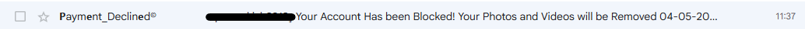
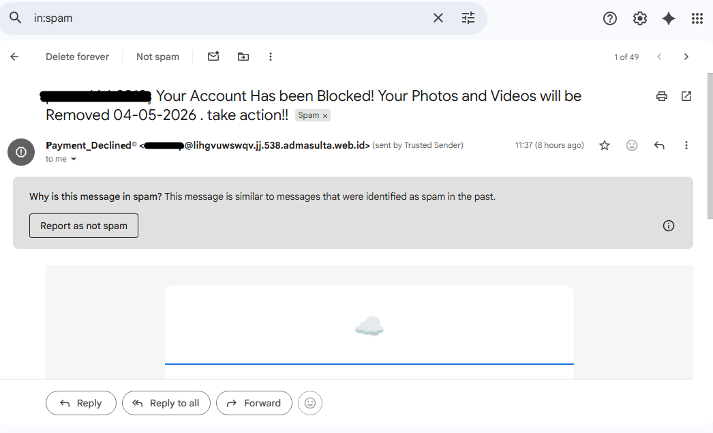
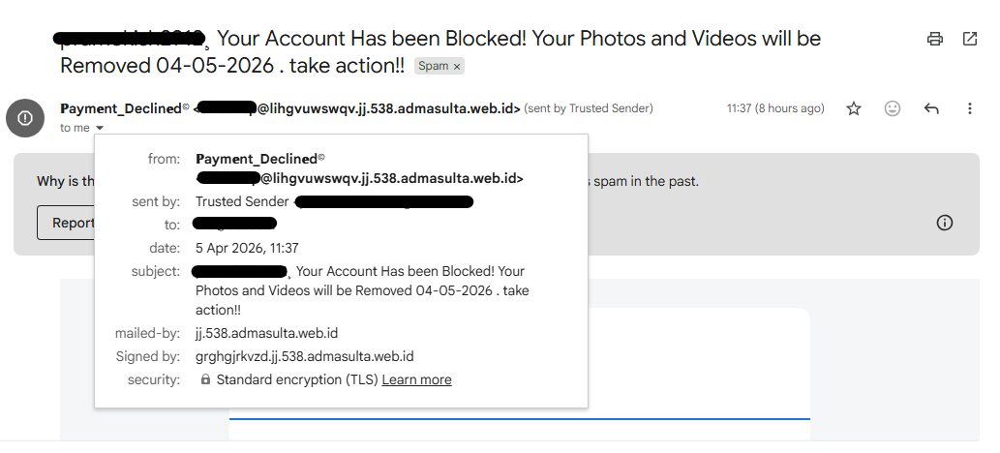
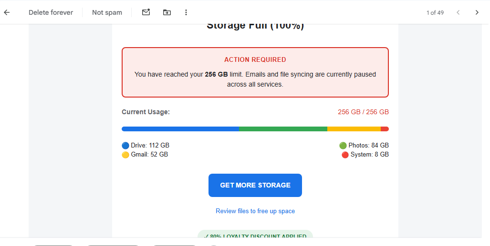
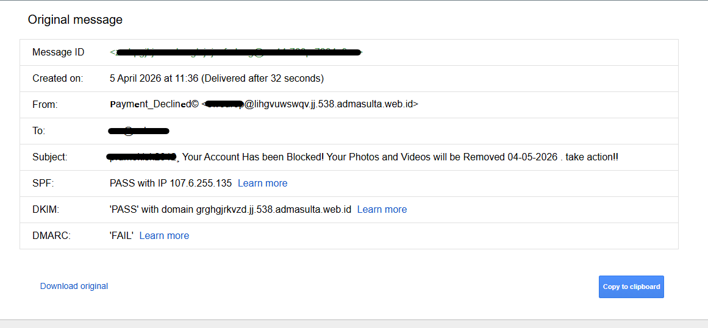
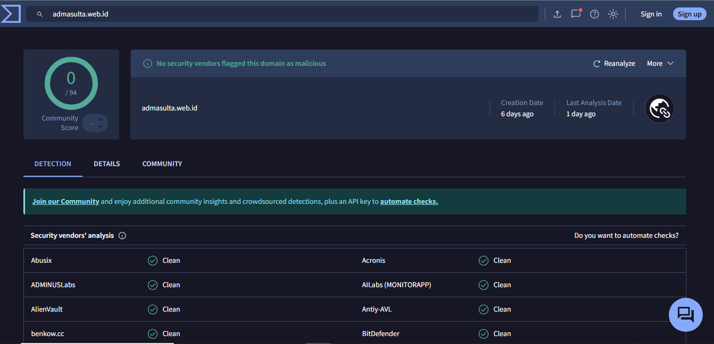

# SOC Investigation Case Study: Phishing Email Impersonating Account Storage Alert

## Scenario Summary
This project documents a small SOC-style phishing email investigation based on a real suspicious email received in a personal mailbox. The email impersonated an account/storage alert and attempted to pressure the recipient into taking immediate action by claiming the account had been blocked and that stored photos and videos would be removed.

The purpose of this case study was to demonstrate entry-level SOC analyst skills including phishing triage, email metadata review, indicator identification, reputation checking, and structured incident documentation.

---

## Initial Alert / User Report
A suspicious email was received claiming that the account had been blocked and that photos and videos would be removed unless immediate action was taken.

---

## Investigation Scope
This investigation focused on:

- sender identity and sender details
- subject line and email body content
- social engineering and phishing indicators
- Gmail metadata review using **Show original**
- domain reputation context using VirusTotal

### Out of Scope
This case study did **not** include:

- malware execution
- attachment detonation
- enterprise-wide mailbox search
- deep forensic analysis
- confirmed account compromise
- attacker attribution

---

## Evidence Collected
The following evidence was collected and sanitized before publication:

- inbox/list view screenshot
- email overview screenshot
- sender details popup screenshot
- email body screenshot
- Gmail **Show original** screenshot
- VirusTotal domain reputation screenshot

---

## Screenshot Evidence

### 1. Inbox / message list view

### 2. Email overview

### 3. Sender details

### 4. Email body

### 5. Gmail "Show original"

### 6. VirusTotal domain check

---

## Indicators Observed
The following indicators supported the phishing assessment:

- The message used urgency and fear-based language to pressure immediate action.
- The subject line claimed account blockage and data removal, which is a common phishing lure.
- The sender display name, **"Payment_Declined,"** did not align with the account/storage theme of the message.
- The sender domain appeared suspicious and did not resemble a legitimate Google or cloud storage service domain.
- The email body used an account storage warning theme to create pressure and encourage clicking.
- Gmail classified the message as spam, which supported the suspicion.
- The message included a prominent call-to-action button: **"GET MORE STORAGE."**
- In Gmail **Show original**, SPF passed and DKIM passed, but DMARC failed.
- The **mailed-by** and **signed-by** values were associated with unusual domains and did not support the legitimacy of the claimed service.

---

## Investigation Steps Taken
1. Reviewed the subject line and sender display name for obvious phishing indicators.
2. Checked the sender details popup to review the **from**, **sent by**, **mailed-by**, and **signed-by** fields.
3. Reviewed the email body to identify urgency, impersonation, and social engineering themes.
4. Confirmed that Gmail had already classified the message as spam.
5. Opened Gmail **Show original** to review authentication results and message metadata.
6. Compared the sender identity and domain-related information with the service being impersonated.
7. Performed a VirusTotal domain reputation check on `admasulta.web.id`.

---

## Reputation Check
A VirusTotal domain reputation check was performed on `admasulta.web.id`.

### Results observed
- 0/94 security vendors flagged the domain as malicious at the time of review
- Domain creation date was shown as **6 days old**
- Last analysis date was shown as **1 day ago**

### Interpretation
The public reputation result was **inconclusive**. Although the domain was not flagged by vendors at the time of review, its very recent creation date was suspicious in the context of an email impersonating an account/storage alert. This result was treated as supporting context rather than evidence of legitimacy.

---

## Findings
- The email impersonated an account/storage alert to pressure the recipient into taking immediate action.
- The sender identity did not align with the service being imitated.
- The domain structure appeared suspicious and inconsistent with a legitimate cloud storage provider.
- The body content used fear-based language and a strong call to action, both common phishing traits.
- Although SPF and DKIM passed, DMARC failed, and the authentication details still did not support the legitimacy of the message.
- The VirusTotal result did not confirm maliciousness, but the very recent domain creation date increased suspicion.
- Based on the content, sender details, metadata, and domain context, the email was assessed as **likely phishing**.

---

## Timeline
- Suspicious email identified in Gmail spam
- Subject line and sender reviewed
- Sender details popup examined
- Email body reviewed for phishing indicators
- Gmail **Show original** used to review authentication details
- VirusTotal domain reputation check performed
- Email assessed as likely phishing

---

## Analyst Assessment / Verdict
**Verdict: Likely phishing**

This message was assessed as likely phishing because it used an account/storage impersonation theme, urgency-based language, a mismatched sender identity, suspicious domain-related details, and inconsistent authentication context. Although some technical authentication checks passed, the overall message characteristics did not support legitimacy.

---

## Severity
**Medium**

### Reason
The email appears designed to pressure the recipient into clicking a link or taking action based on fear and urgency. However, there was no evidence of interaction, credential submission, or confirmed compromise in this case.

---

## Recommended Response Actions
- Do not click links or reply to the sender.
- Report the email as phishing and keep it out of the inbox.
- Block the sender or domain in an enterprise environment if confirmed malicious.
- Search for similar messages if this type of email appears in a business mailbox environment.
- Reset account credentials only if the recipient interacted with the message or submitted information.
- Remove similar messages from affected mailboxes if confirmed malicious.

---

## Lessons Learned
- A phishing email can still appear technically convincing even when parts of email authentication pass.
- SPF and DKIM passing alone do not make an email trustworthy.
- Sender identity, domain context, message tone, and authentication alignment should all be reviewed together.
- Newly created domains can be an important supporting indicator during phishing triage.
- Clear documentation and structured triage are valuable SOC analyst skills, even in small investigations.

---

## Interview Summary
In this project, I investigated a real suspicious email that impersonated an account storage alert. I reviewed the sender identity, email content, phishing indicators, Gmail metadata, and domain reputation context. Although SPF and DKIM passed, DMARC failed, and the sender/domain details did not align with a legitimate service. Based on the overall evidence, I assessed the message as likely phishing and documented realistic response actions. This project helped me practise SOC-style triage and investigation documentation in a small but realistic scenario. 